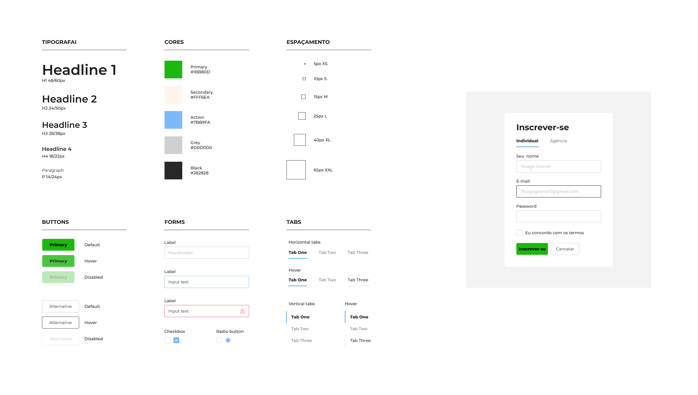

<h1 align="center">Registrar-se</h1>

Design System de uma tela para registro de novos usuários

  <a href="#-tecnologias">Tecnologias</a>&nbsp;&nbsp;&nbsp;|&nbsp;&nbsp;&nbsp;
  <a href="#-projeto">Projeto</a>&nbsp;&nbsp;&nbsp;|&nbsp;&nbsp;&nbsp;
  <a href="#-layout">Layout</a>&nbsp;&nbsp;&nbsp;|&nbsp;&nbsp;&nbsp;

  

## 🚀 Tecnologias

Esse projeto foi desenvolvido com as seguintes tecnologias:

- Git e Github
- Figma

## 🔖 Layout

Você pode visualizar o layout do projeto através [DESSE LINK](<https://www.figma.com/design/q7pL6eVaDRAw7bnj5nTLYR/Basic-Design%C2%A0System-(Community)?node-id=0-2&m=dev&t=tNWxUOUJh4PSNhtZ-1>). É necessário ter conta no [Figma](https://figma.com) para acessá-lo.